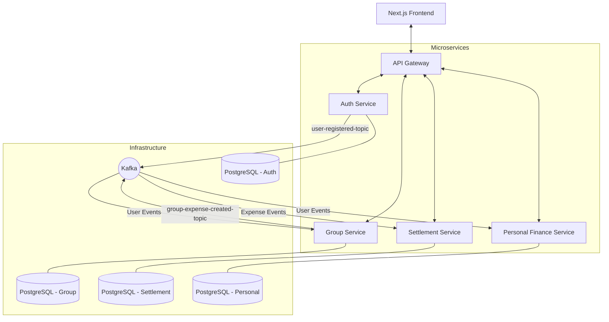

# FinSync: Modern Microservices Expense Management Platform


FinSync is a high-performance, scalable expense management platform built on a modern microservices architecture. It enables users to track personal finances, manage group expenses, and automate complex debt settlements with a seamless, real-time experience.

---

## 🏗️ Architecture Overview

FinSync leverages an event-driven microservices architecture to ensure high availability, scalability, and loose coupling between components.



---

## 🚀 Key Features

- **🔐 Unified Authentication**: Secure JWT-based authentication with role-based access control.
- **👥 Collaborative Group Expenses**: Create groups, invite members, and split expenses effortlessly.
- **⚖️ Automated Settlements**: Advanced algorithms to simplify debts and generate optimal settlement plans.
- **📊 Personal Finance Insights**: Detailed analytics, budgeting tools, and transaction categorization.
- **⚡ Real-time Event Synchronization**: Asynchronous service communication via Kafka for decoupled data handling.
- **🎨 Premium UI/UX**: Dark-mode first design with smooth animations and responsive layouts.

---

## 🛠️ Tech Stack

### Backend (Microservices)

- **Language**: Java 21
- **Framework**: Spring Boot (3.3.5 / 4.0.3)
- **Security**: Spring Security + JWT
- **Gateway**: Spring Cloud Gateway
- **Persistence**: Spring Data JPA / Hibernate
- **Database**: PostgreSQL 15
- **Messaging**: Apache Kafka (Event-driven architecture)
- **Mapping**: MapStruct for high-performance DTO mapping
- **Utils**: Lombok, Jackson

### Frontend

- **Framework**: Next.js 14 (App Router)
- **Library**: React 18
- **Language**: TypeScript
- **Styling**: Tailwind CSS
- **State Management**: Zustand
- **Data Fetching**: TanStack Query (React Query)
- **Components**: Radix UI, Lucide Icons
- **Animations**: Framer Motion
- **Visualizations**: Recharts

---

## 📂 Service Breakdown

| Service                | Responsibility                                                     |
| :--------------------- | :----------------------------------------------------------------- |
| **API Service**        | Central entry point, request routing, and JWT validation.          |
| **Auth Service**       | User identity management, registration, and secure authentication. |
| **Group Service**      | Management of groups, members, and shared expenses.                |
| **Settlement Service** | Calculation of balances and generation of debt-settlement plans.   |
| **Personal Finance**   | Individual expense tracking, budgeting, and financial analytics.   |
| **Common Events**      | Shared library for event schemas and serializable Kafka payloads.  |

---

## ⚙️ Getting Started

### Prerequisites

- **JDK 21+**
- **Node.js 18+**
- **Docker & Docker Compose**
- **Maven 3.9+**

### Installation

1. **Clone the repository**:

   ```bash
   git clone https://github.com/Adipatil7/finsync-microservices.git
   cd finsync-microservices
   ```

2. **Build the Backend**:

   ```bash
   # Build the parent and install shared events
   cd common-events && mvn clean install
   cd ..
   # Build individual services (optional, docker-compose will handle this)
   ```

3. **Install Frontend Dependencies**:
   ```bash
   cd finsync-frontend
   npm install
   ```

### Running with Docker

The easiest way to start the entire platform is using Docker Compose:

```bash
cd Infrastructure
docker-compose up -d
```

This will spin up:

- 4 PostgreSQL instances (Auth, Group, Settlement, Personal)
- Kafka & Zookeeper/KRaft cluster
- All Backend Microservices
- API Gateway

The services will be available at `http://localhost:8080`.

---

## 📝 License

This project is licensed under the MIT License - see the [LICENSE](LICENSE) file for details.

---

_Created with ❤️ me._
